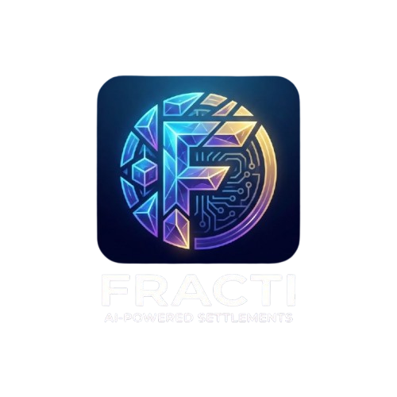

<p align="center">
  
</p>

<h1 align="center">Fracti</h1>

<p align="center">
  <strong>Fractionalize costs. Settle on-chain.</strong>
</p>

<p align="center">
  <a href="#features">Features</a> •
  <a href="#how-it-works">How It Works</a> •
  <a href="#tech-stack">Tech Stack</a> •
  <a href="#quick-start">Quick Start</a> •
  <a href="#architecture">Architecture</a> •
  <a href="#api-reference">API</a>
</p>

<p align="center">
  
  
  
  
  
  
</p>

---

**Fracti** is an AI-powered Telegram Mini App that transforms group chat chaos into structured expense management with blockchain-powered settlements. Just talk naturally, and let Claude AI handle the rest.

```
"@FractiBot I paid 150 for dinner with @alice and @bob"

   ✅ Expense created: dinner (150 TON)
      Paid by you, split 3 ways (50 TON each)
```

---

## Key Highlights

<table>
<tr>
<td width="33%" valign="top">

### AI-Powered
Natural language expense parsing and receipt OCR powered by **Claude AI** via AWS Bedrock

</td>
<td width="33%" valign="top">

### On-Chain Payments
**TON Connect** wallet integration with native TON and USDT payments — settle debts with one tap

</td>
<td width="33%" valign="top">

### Smart Optimization
**Min-cash-flow algorithm** minimizes transactions needed to settle all group debts

</td>
</tr>
</table>

---

## Features

### Telegram Bot

| Feature | Description |
|---------|-------------|
| **Automatic User Tracking** | Bot captures all group messages to automatically track members — no manual registration |
| **Smart AI Trigger** | Expense parsing only activates when bot is @mentioned — no spam, no false positives |
| **Natural Language Parsing** | Write naturally: `@FractiBot I paid 100 for dinner with @alice and @bob` |
| **Receipt OCR** | Send a receipt photo — Claude Vision extracts merchant, items, and totals automatically |
| **Multi-language** | Full support for English and Russian with auto-detection from Telegram settings |
| **Avatar Sync** | Automatically fetches Telegram profile photos and syncs them to the app |

### Expense Management

| Feature | Description |
|---------|-------------|
| **Flexible Splits** | Equal split, exact amounts, or percentage-based — you choose |
| **Expense History** | Full searchable history with filters (all, mine, I owe) and pagination |
| **Edit & Delete** | Modify or remove expenses with complete audit trail |
| **Smart Categories** | AI automatically categorizes expenses (food, transport, entertainment, etc.) |
| **Recurring Templates** | Set up recurring expenses that repeat on schedule |

### Debt Optimization

| Feature | Description |
|---------|-------------|
| **Debt Graph** | Interactive force-directed visualization showing who owes whom |
| **Min-Cash-Flow** | Minimizes transactions needed to settle all debts with optimal paths |
| **Real-time Balances** | Always know what you owe and what you're owed |
| **Settlement Suggestions** | One-click optimal payment paths |

### TON Blockchain Integration

Fracti is a **Web3-native** expense app with full TON blockchain integration for trustless, on-chain settlements.

| Feature | Description |
|---------|-------------|
| **Wallet Connection** | Connect any TON wallet via TON Connect 2.0 (Tonkeeper, OpenMask, MyTonWallet, TON Wallet) |
| **In-App Payments** | Send TON directly to group members to settle debts — no copy-pasting addresses |
| **USDT & Jetton Support** | Pay with USDT, NOT, or any jetton on TON network |
| **Real-Time Monitoring** | Track payment status from pending → confirmed with live blockchain verification |
| **Transaction Verification** | Automatic on-chain verification via TON Center API with transaction hash linking |
| **TON Proof Auth** | Cryptographic wallet ownership verification — prove you own your wallet |
| **Payment History** | Complete settlement history with blockchain explorer links for transparency |

```
┌─────────────────────────────────────────────────────────────────────────┐
│                        TON PAYMENT FLOW                                  │
├─────────────────────────────────────────────────────────────────────────┤
│                                                                          │
│  1. CONNECT          2. PAY               3. VERIFY         4. SETTLE   │
│  ┌──────────┐       ┌──────────┐        ┌──────────┐      ┌──────────┐  │
│  │ Tonkeeper  │     │ Send TON │        │ Monitor  │      │ ✓ Paid   │  │
│  │ OpenMask   │ ──▶ │ or USDT  │  ───▶  │ On-Chain │ ───▶ │ Settled  │  │
│  │MyTonWallet │     │ In-App   │        │ Status   │      │ Recorded │  │
│  └──────────┘       └──────────┘        └──────────┘      └──────────┘  │
│                                                                          │
│  TON Connect 2.0     One-Tap Pay         TON Center API    DynamoDB     │
│                                                                          │
└─────────────────────────────────────────────────────────────────────────┘
```

### Security & Privacy

| Feature | Description |
|---------|-------------|
| **Telegram Auth** | All requests validated using official Telegram init data |
| **HSTS Enabled** | Strict Transport Security for all connections |
| **Secure IDs** | `crypto.randomUUID()` for all identifiers |
| **Input Validation** | Zod schemas validate all API inputs |
| **Rate Limiting** | Per-endpoint rate limiting with separate AI quotas |
| **WAF Protection** | AWS Web Application Firewall for DDoS protection |

---

## How It Works

### Message Flow

```
┌──────────────────────────────────────────────────────────────────────┐
│                           GROUP CHAT                                  │
├──────────────────────────────────────────────────────────────────────┤
│                                                                       │
│  Alice: "Hey everyone!"                                               │
│         ↓                                                             │
│         Bot: [silently registers Alice + fetches avatar]              │
│                                                                       │
│  Bob: "Let's get pizza"                                               │
│       ↓                                                               │
│       Bot: [silently registers Bob + fetches avatar]                  │
│                                                                       │
│  Alice: "@FractiBot I paid 45 for pizza, split with Bob"              │
│         ↓                                                             │
│         Bot: Parses with Claude AI                                    │
│         ↓                                                             │
│         Bot: "✅ Expense created: pizza (45 TON)                      │
│               Paid by Alice, split 2 ways (22.50 each)"               │
│                                                                       │
└──────────────────────────────────────────────────────────────────────┘
```

### AI Expense Parsing

```
Input:  "@FractiBot I paid 50 TON for dinner with Alice and Bob"

Claude AI extracts:
┌────────────────────────────────────────┐
│  payer: null (message sender)          │
│  amount: 50                            │
│  currency: "TON"                       │
│  description: "dinner"                 │
│  beneficiaries: ["Alice", "Bob"]       │
│  splitType: "equal"                    │
│  confidence: 0.95                      │
└────────────────────────────────────────┘

Result: Expense created, split 3 ways (16.67 TON each)
```

### Receipt Vision

```
Input: [Photo of restaurant receipt]

Claude Vision extracts:
┌────────────────────────────────────────┐
│  merchant: "Pizza Palace"              │
│  date: "2026-01-15"                    │
│  items:                                │
│    - Margherita Pizza    $12.00        │
│    - Pepperoni Pizza     $14.00        │
│    - Drinks (x3)          $9.00        │
│  subtotal: $35.00                      │
│  tax: $3.15                            │
│  total: $38.15                         │
│  confidence: 0.94                      │
└────────────────────────────────────────┘
```

### Min-Cash-Flow Algorithm

The algorithm minimizes the number of transactions needed to settle all debts:

```
BEFORE optimization:              AFTER optimization:
┌─────────────────────┐           ┌─────────────────────┐
│ Alice → Bob: $30    │           │                     │
│ Bob → Carol: $30    │    →      │ Alice → Carol: $20  │
│ Carol → Alice: $10  │           │                     │
└─────────────────────┘           └─────────────────────┘

3 transactions                    1 transaction
```

---

## Tech Stack

### Frontend
| Technology | Purpose |
|------------|---------|
| **React 19** | UI framework with latest features |
| **React Router 7** | File-based routing with SSR |
| **Vite** | Lightning-fast build tool |
| **Tailwind CSS 4** | Utility-first styling |
| **Radix UI** | Accessible component primitives |
| **TanStack Query** | Server state management |
| **TON Connect UI** | Wallet integration |
| **i18next** | Internationalization (EN, RU) |

### Backend
| Technology | Purpose |
|------------|---------|
| **Hono** | Lightweight, fast web framework |
| **Grammy** | Telegram Bot framework |
| **ElectroDB** | DynamoDB ORM with single-table design |
| **AWS Lambda** | Serverless compute (Node.js 22, ARM64) |
| **API Gateway** | HTTP API with CORS |
| **DynamoDB** | NoSQL database with 3 GSIs |
| **S3** | Avatar and asset storage |

### AI & Blockchain
| Technology | Purpose |
|------------|---------|
| **AWS Bedrock** | Managed AI service |
| **Claude** | Text parsing and receipt vision |
| **TON Connect 2.0** | Wallet connection protocol |
| **@ton/core** | TON blockchain utilities |

### Infrastructure
| Technology | Purpose |
|------------|---------|
| **AWS CDK** | Infrastructure as Code |
| **CloudFront** | Global CDN |
| **WAF** | Web Application Firewall |
| **CloudWatch** | Logging and monitoring |

---

## Quick Start

### Prerequisites

- **Node.js 22+**
- **pnpm 10+**
- **AWS CLI** configured with credentials
- **Telegram Bot Token** from [@BotFather](https://t.me/BotFather)

### 1. Clone & Install

```bash
git clone https://github.com/your-username/fracti.git
cd fracti
pnpm install
```

### 2. Configure Environment

Create a `.env` file:

```bash
# AWS Credentials
AWS_ACCESS_KEY_ID=your_access_key
AWS_SECRET_ACCESS_KEY=your_secret_key
AWS_REGION=us-east-1

# Telegram
TELEGRAM_BOT_TOKEN=your_bot_token_from_botfather
MINI_APP_URL=https://t.me/FractiBot/app

# TON (optional)
TONCENTER_API_KEY=your_toncenter_api_key
```

### 3. Deploy

```bash
# One-command deployment
./scripts/deploy.sh
```

This script will:
1. Build all packages
2. Deploy AWS infrastructure via CDK
3. Configure Telegram webhook
4. Upload frontend to S3
5. Invalidate CloudFront cache

### Local Development

```bash
# Start frontend dev server
pnpm dev

# Start bot in polling mode
pnpm dev:bot
```

---

## Architecture

```
┌─────────────────────────────────────────────────────────────────────────────┐
│                              TELEGRAM                                        │
├─────────────────────────────────────────────────────────────────────────────┤
│                                                                              │
│   ┌─────────────┐                              ┌─────────────────────┐       │
│   │ Group Chat  │──────────────────────────────│ Mini App (WebView)  │       │
│   │ @FractiBot  │                              │ React + Vite        │       │
│   └──────┬──────┘                              └──────────┬──────────┘       │
│          │                                                │                  │
└──────────│────────────────────────────────────────────────│──────────────────┘
           │ Webhook                                        │ HTTPS
           ▼                                                ▼
┌─────────────────────────────────────────────────────────────────────────────┐
│                              AWS CLOUD                                       │
├─────────────────────────────────────────────────────────────────────────────┤
│                                                                              │
│   ┌─────────────┐         ┌─────────────┐         ┌─────────────┐           │
│   │ Bot Lambda  │         │ API Gateway │         │ CloudFront  │           │
│   │   Grammy    │         │    HTTP     │─────────│    CDN      │           │
│   └──────┬──────┘         └──────┬──────┘         └─────────────┘           │
│          │                       │                                          │
│          │         ┌─────────────┴─────────────┐                            │
│          │         │                           │                            │
│          ▼         ▼                           ▼                            │
│   ┌─────────────────────┐             ┌─────────────┐                       │
│   │    Server Lambda    │             │  S3 Bucket  │                       │
│   │   Hono + ElectroDB  │             │   Assets    │                       │
│   └──────────┬──────────┘             └─────────────┘                       │
│              │                                                              │
│   ┌──────────┼────────────────────────────────┐                             │
│   │          │                                │                             │
│   ▼          ▼                                ▼                             │
│ ┌──────────────────┐  ┌──────────────────┐  ┌──────────────────┐            │
│ │    DynamoDB      │  │   AWS Bedrock    │  │    S3 Avatars    │            │
│ │  Single Table    │  │   Claude AI      │  │  Profile Photos  │            │
│ └──────────────────┘  └──────────────────┘  └──────────────────┘            │
│                                                                              │
└─────────────────────────────────────────────────────────────────────────────┘
           │
           │ TON Connect 2.0
           ▼
┌─────────────────────────────────────────────────────────────────────────────┐
│                           TON BLOCKCHAIN                                     │
├─────────────────────────────────────────────────────────────────────────────┤
│                                                                              │
│   ┌─────────────────────────────────────────────────────────────────────┐   │
│   │                      WALLET CONNECTION                               │   │
│   │   ┌───────────┐    ┌───────────┐    ┌───────────┐    ┌───────────┐  │   │
│   │   │ Tonkeeper │    │MyTonWallet│    │ OpenMask  │    │ TON Wallet│  │   │
│   │   └───────────┘    └───────────┘    └───────────┘    └───────────┘  │   │
│   └─────────────────────────────────────────────────────────────────────┘   │
│                                    │                                         │
│                                    ▼                                         │
│   ┌─────────────────────────────────────────────────────────────────────┐   │
│   │                      PAYMENT PROCESSING                              │   │
│   │   • Native TON transfers          • USDT Jetton payments            │   │
│   │   • Real-time tx monitoring       • On-chain verification           │   │
│   │   • TON Center API integration    • Block explorer links            │   │
│   └─────────────────────────────────────────────────────────────────────┘   │
│                                                                              │
└─────────────────────────────────────────────────────────────────────────────┘
```

---

## Project Structure

```
fracti/
├── apps/
│   ├── bot/                    # Telegram Bot (Grammy + Lambda)
│   │   ├── handlers/           # Command & message handlers
│   │   ├── services/           # AI, expense, user services
│   │   ├── integrations/       # Bedrock, S3, Telegram APIs
│   │   ├── i18n/               # Translations (EN, RU)
│   │   └── bot.ts              # Bot initialization
│   │
│   ├── server/                 # API Server (Hono + Lambda)
│   │   ├── controllers/        # Request handlers
│   │   ├── services/           # Business logic
│   │   ├── middleware/         # Auth, rate limiting
│   │   └── lib/                # Shared utilities
│   │
│   └── web/                    # Frontend (React + Vite)
│       └── app/
│           ├── components/     # UI components
│           ├── providers/      # Context providers
│           ├── hooks/          # Custom hooks
│           ├── routes/         # Page routes
│           └── services/       # API client
│
├── libs/
│   ├── ai/                     # AWS Bedrock integration
│   ├── db/                     # ElectroDB entities
│   ├── types/                  # Shared TypeScript types
│   └── constants/              # App-wide constants
│
├── infra/cdk/                  # AWS CDK Infrastructure
│   ├── lib/stacks/             # CDK stacks
│   └── scripts/                # Deployment scripts
│
├── tests/                      # Unit tests
├── e2e/                        # Playwright E2E tests
└── docs/                       # Documentation
```

---

## Database Schema

Single-table DynamoDB design with three Global Secondary Indexes:

| PK | SK | GSI1 | GSI2 | GSI3 | Type |
|----|----|----- |------|------|------|
| `GROUP#<id>` | `METADATA` | — | — | — | Group |
| `GROUP#<id>` | `USER#<tgId>` | `USER#<tgId>` | — | — | Member |
| `GROUP#<id>` | `TX#<ts>` | — | `EXPENSE#<id>` | `USER#<payerId>` | Expense |
| `GROUP#<id>` | `SETTLE#<ts>` | — | `SETTLEMENT#<id>` | `USER#<fromId>` | Settlement |
| `GROUP#<id>` | `PART#<exp>#<usr>` | `USER#<userId>` | — | — | Participant |

**Index Usage:**
- **GSI1** — Find all groups for a user, find expenses user owes
- **GSI2** — O(1) lookup by expense/settlement ID
- **GSI3** — User activity timeline

See [docs/DATABASE_SCHEMA.md](./docs/DATABASE_SCHEMA.md) for complete documentation.

---

## API Reference

### Authentication

All endpoints require Telegram `initData` validation via the `Authorization` header.

### Groups

| Method | Endpoint | Description |
|--------|----------|-------------|
| `GET` | `/api/groups` | List user's groups |
| `GET` | `/api/groups/:id` | Get group with members |
| `GET` | `/api/groups/:id/activity` | Activity timeline |
| `POST` | `/api/groups` | Create new group |
| `POST` | `/api/groups/:id/join` | Join a group |
| `PUT` | `/api/groups/:id/wallet` | Update wallet address |

### Expenses

| Method | Endpoint | Description |
|--------|----------|-------------|
| `GET` | `/api/groups/:id/expenses` | List expenses (paginated) |
| `GET` | `/api/groups/:id/expenses/:eid` | Get single expense |
| `POST` | `/api/groups/:id/expenses` | Create expense |
| `DELETE` | `/api/groups/:id/expenses/:eid` | Delete expense |

### Settlements

| Method | Endpoint | Description |
|--------|----------|-------------|
| `GET` | `/api/groups/:id/debts` | Get optimized debt graph |
| `GET` | `/api/groups/:id/settlements` | List settlements |
| `POST` | `/api/groups/:id/settlements` | Create settlement |
| `PUT` | `/api/groups/:id/settlements/:sid` | Update with tx hash |
| `POST` | `/api/groups/:id/settlements/:sid/verify-payment` | Verify TON payment |

### AI

| Method | Endpoint | Description |
|--------|----------|-------------|
| `POST` | `/api/ai/parse-expense` | Parse natural language expense |
| `POST` | `/api/ai/parse-receipt` | Extract data from receipt image |

### TON Proof

| Method | Endpoint | Description |
|--------|----------|-------------|
| `POST` | `/api/ton-proof/payload` | Generate proof payload |
| `POST` | `/api/ton-proof/verify` | Verify wallet ownership |

---

## Bot Commands

| Command | Scope | Description |
|---------|-------|-------------|
| `/start` | All | Welcome message with app link |
| `/help` | All | Usage instructions |
| `/balance` | All | View group balances |
| `/expenses` | All | View expense history |
| `/settle` | All | Open payment page |
| `/add` | All | Expense creation help |
| `/lang` | Private | Change language preference |

---

## Environment Variables

| Variable | Required | Default | Description |
|----------|----------|---------|-------------|
| `TELEGRAM_BOT_TOKEN` | Yes | — | Bot token from @BotFather |
| `TABLE_NAME` | Auto | — | DynamoDB table (set by CDK) |
| `S3_BUCKET_NAME` | Auto | — | Avatar bucket (set by CDK) |
| `BEDROCK_MODEL_ID` | No | claude-sonnet | Claude model ID |
| `AWS_REGION` | No | us-east-1 | AWS region |
| `MINI_APP_URL` | No | — | Mini App deep link |
| `TONCENTER_API_KEY` | No | — | TON Center API key |
| `JWT_SECRET` | No | Auto | JWT signing secret |
| `ALLOWED_ORIGINS` | No | telegram.org | CORS origins |

---

## Scripts

```bash
# Deployment
./scripts/deploy.sh          # Full deployment (build + CDK + S3)

# Development
pnpm dev                     # Start frontend dev server
pnpm dev:bot                 # Start bot in polling mode

# Build
pnpm build                   # Build all packages
pnpm build:gui               # Build frontend only
pnpm build:bot               # Build bot only

# Quality
pnpm typecheck               # TypeScript check
pnpm lint                    # ESLint
pnpm test                    # Vitest unit tests
pnpm test:e2e                # Playwright E2E tests

# CDK (from infra/cdk/)
pnpm exec cdk bootstrap      # Bootstrap AWS (first time)
pnpm exec cdk deploy         # Deploy infrastructure
```

---

## Roadmap

### Completed

- [x] AI-powered expense parsing (Claude via Bedrock)
- [x] Receipt OCR with Claude Vision
- [x] Automatic user tracking from messages
- [x] User avatar fetching and S3 storage
- [x] Smart AI trigger (@mention only)
- [x] Multi-language support (EN, RU)
- [x] TON Connect wallet integration
- [x] USDT & Jetton payments
- [x] Min-cash-flow debt optimization
- [x] Interactive debt graph visualization
- [x] TON Proof wallet verification
- [x] Recurring expense templates
- [x] Group analytics dashboard
- [x] One-command deployment

### Planned

- [ ] Push notifications for new expenses
- [ ] Currency conversion with live rates
- [ ] Export to CSV/PDF
- [ ] Expense attachments (photos, files)
- [ ] Budget tracking and alerts
- [ ] Expense reminders

---

## Contributing

Contributions are welcome! Please read our contributing guidelines before submitting a PR.

1. Fork the repository
2. Create your feature branch (`git checkout -b feature/amazing-feature`)
3. Commit your changes (`git commit -m 'Add amazing feature'`)
4. Push to the branch (`git push origin feature/amazing-feature`)
5. Open a Pull Request

---

## License

MIT License — see [LICENSE](LICENSE) for details.

---

<p align="center">
  Built with ❤️ by <a href="https://github.com/nmime">@nmime</a>
</p>

<p align="center">
  <a href="https://t.me/FractiBot">
    
  </a>
</p>
